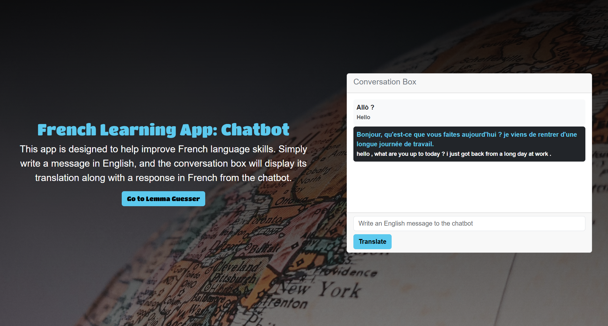
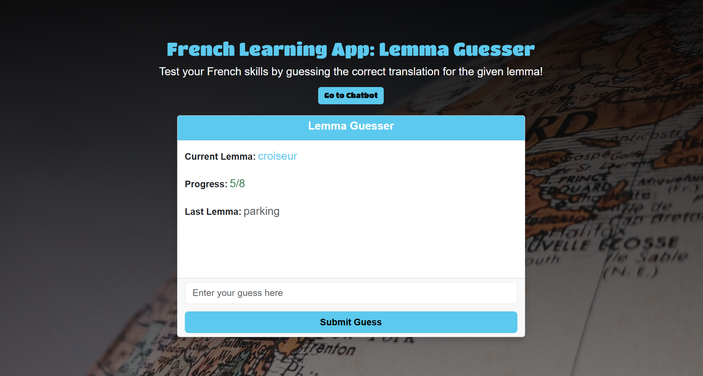

# French Learning App

A web app designed to help improve French language skills through interactive chatbot conversations and a lemma guessing game.

---

## Features
1. **Chatbot**
    - Have conversations with a French chatbot.
    - Input messages in English, and the chatbot will respond in French.
    - View translations of your input and the chatbot's responses.

2. **Lemma Guesser**
    - Test your French vocabulary by guessing the correct translation of randomly generated lemmas (base forms of words).
    - Track your progress with a score counter showing correct guesses out of total attempts.

---

## Technologies Used
- **Backend**: Flask (Python)
- **Frontend**: HTML, CSS, Bootstrap
- **Machine Learning Models**:
    - Translation: Helsinki-NLP/opus-mt-tc-big-en-fr
    - Chatbot: facebook/blenderbot_small-90M
- **Other Libraries**:
    - transformers for NLP models
    - torch for PyTorch-based computations

---

## Installation

Prerequisites
- Python 3.8 or higher
- Pip (Python package manager)

Steps

1. Clone the repository:

    ```bash
    git clone <repo>
    cd french-learning-chatbot
    ```

2. Create and activate a virtual environment:

    ```bash
    python -m venv venv
    source venv/bin/activate  # On Windows: venv\Scripts\activate
    ```

3. Install dependencies:

    ```bash
    pip install -r requirements.txt
    ```

4. Run the application:

    ```bash
    flask run
    ```

5. Open your browser and navigate to:

    ```bash
    http://127.0.0.1:5000
    ```

---

## Usage

Chatbot

1. Enter an English message in the input box.
2. View the chatbot's response in French along with the English translation.

Lemma Guesser

1. Go to the Lemma Guesser by clicking the "Go to Lemma Guesser" button.
2. Guess the correct French translation for the displayed lemma.
3. View your progress and feedback for each guess.

---

## Screenshots

Chatbot Interface



Lemma Guesser

